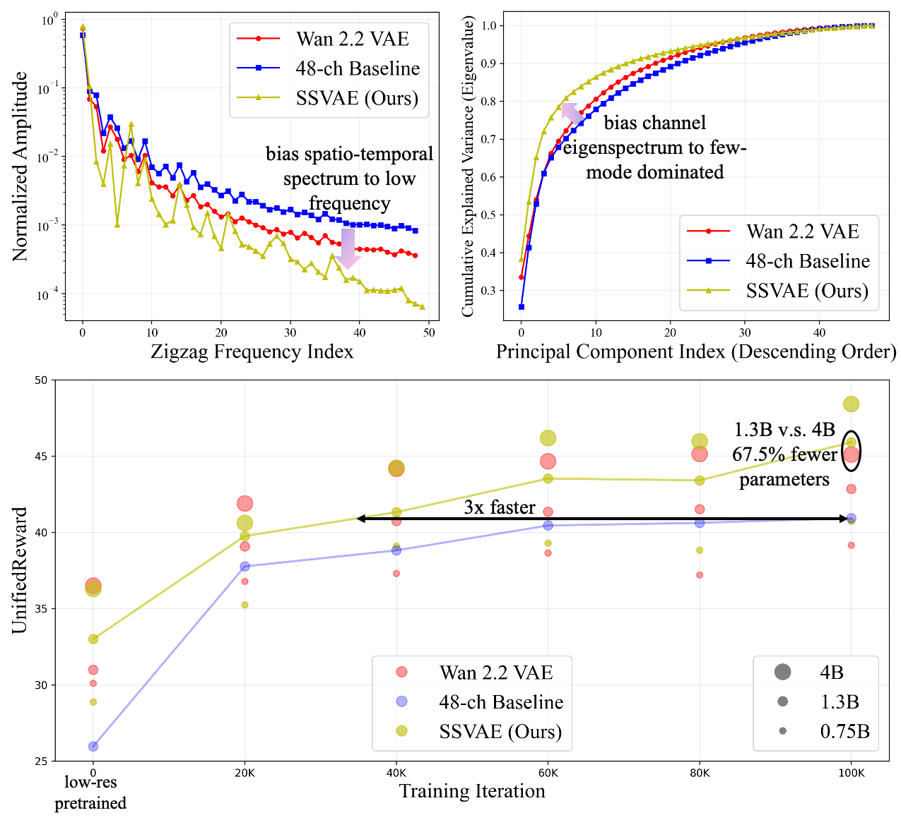

# Delving into Latent Spectral Biasing of Video VAEs for Superior Diffusability

<div align="center">

[](https://huggingface.co/zai-org/SSVAE)
[](https://modelscope.cn/models/ZhipuAI/SSVAE)
[](https://example.com)

</div>

This repository contains the official implementation of the paper **"Delving into Latent Spectral Biasing of Video VAEs
for Superior Diffusability"**.

Most existing video VAEs prioritize reconstruction fidelity, often overlooking the latent structure's impact on
downstream diffusion training. Our research identifies properties of video VAE latent spaces that facilitate diffusion
training through statistical analysis of VAE latents. Our key finding is that biased, rather than uniform, spectra lead
to improved diffusability. Motivated by this, we introduce **SSVAE (Spectral-Structured VAE)**, which optimizes the *
*spectral properties** of the latent space to enhance its **"Diffusability"**.

<div align="center">

</div>

### 🔥 Key Highlights

* **Spectral Analysis of Latents**: We identify two statistical properties essential for efficient diffusion training: a
  **low-frequency biased spatio-temporal spectrum** and a **few-mode biased channel eigenspectrum**.
* **Local Correlation Regularization (LCR)**: A lightweight regularizer that explicitly enhances local spatio-temporal
  correlations to induce low-frequency bias.
* **Latent Masked Reconstruction (LMR)**: A mechanism that simultaneously promotes few-mode bias and improves decoder
  robustness against noise.
* **Superior Performance**:
    * 🚀 **3× Faster Convergence**: Accelerates text-to-video generation convergence by 3× compared to strong baselines.
    * 📈 **Higher Quality**: Achieves a **10% gain** in video reward scores (UnifiedReward).
    * 🏆 **Outperforms SOTA**: Surpasses open-source VAEs (e.g., Wan 2.2, CogVideoX) in generation quality with fewer
      parameters.

### Data preparetion

We use WebDataset to build the dataset. Please organize your data accordingly before training.
Structure your dataset as follows:

   ```
   data/
  └── webvid/
      ├── 000000.meta.jsonl
      ├── 000000.tar
      ├── 000001.meta.jsonl
      ├── 000001.tar
      └── ...
   ```

- tar files: Each tar should pack multiple video samples. Each sample contains at least ".mp4" and ".id" files. The "
  .id" file must exist, but the content is not important.

- meta files: Each line is a JSON object describing metadata for videos within the corresponding tar. Necessary fields
  include key (video name), duration, fps.
  Example contents for 000000.meta.jsonl:

   ```
   {"key": "1000000006", "duration": 16.0, "fps": 60, ...}
   {"key": "1000000007", "duration": 29.5, "fps": 30, ...}
   ```

> Note: Before training, update the train: dataset path in the config files to your actual data directory.
> Multiple paths can be separated by commas:
> ```
   > path: ";path/to/dataset1,path/to/dataset2,..."
   > ```

### Training

The default training entrypoint is provided by scripts/train.sh. We use 32 H100 GPUs for the first stage of training,
and 8 GPUs for the second stage.

#### Stage 1: Training at 256p (150k steps)

```bash
bash scripts/train.sh configs/ch48_LCR_LMR_256p.yaml ch48_LCR_LMR_256p
```

#### Stage 2: Freeze Encoder, Decoder Finetuning at 512p (50k steps)

(Remember to replace the "ckpt_path" field in the config with the ckpt path obtained from the first stage.)

```bash
bash scripts/train.sh configs/ch48_LCR_LMR_512p_DecoderFinetune.yaml ch48_LCR_LMR_512p_DecoderFinetune
```

### Inference

The default inference entrypoint is provided by scripts/inference.sh. To run reconstruction using a pretrained VAE, use:

```bash
python reconstruction.py --config configs/inference.yaml --input assets/video/0001.mp4 --output output/
```

> Note: Download a pretrained VAE and specify its path in the config:
> ```
> ckpt_path: "SSVAE/ch48_256p_15w_512p_5w.ckpt" ## Replace with your actual path
> ```

> Note: If you encounter an error like
> `ModuleNotFoundError: No module named 'torchvision.transforms.functional_tensor'`
> when importing `pytorchvideo`, this is caused by a compatibility issue between
> older versions of `pytorchvideo` (e.g., 0.1.5) and newer versions of
> `torchvision` (where `torchvision.transforms.functional_tensor` has been
> removed).
>
> Here is the way to fix it:
>
>    Edit the file `venv/lib/python3.*/site-packages/pytorchvideo/transforms/augmentations.py` and replace:
>    ```python
>    import torchvision.transforms.functional_tensor as F_t
>    ```
>    with:
>    ```python
>    from torchvision.transforms import functional as F_t
>    ```

        (int(img.shape[1] * r), int(img.shape[0] * r)),

> Then rerun the inference command.

### Generation Training

Generation training can be achieved by integrating SSVAE into an existing text-to-video training framework. For example,
you can replace the "sat/sgm" directory of [CogVideo](https://github.com/zai-org/CogVideo) with the "ssvae" directory
from this repository and update the VAE inference configuration files accordingly to enable text-to-video training.

### Citation

If you find this repository helpful, please consider citing our work:

```
```
